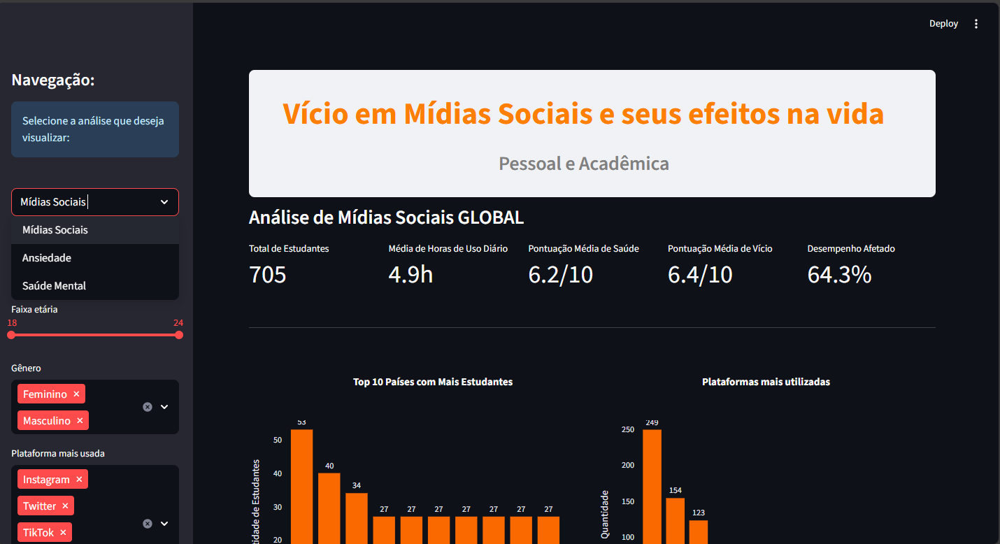

Vício em Mídias Sociais e seus Efeitos na Vida

Análise Interativa com Streamlit

Este projeto explora o impacto do uso de mídias sociais na vida pessoal e acadêmica de estudantes, utilizando Python e Streamlit para criar um dashboard interativo e dinâmico.

Objetivo

O objetivo principal é compreender como o tempo de uso diário das redes sociais influencia fatores como saúde mental, nível de vício digital e desempenho acadêmico.
A aplicação permite filtrar dados por idade, gênero e plataforma, exibindo estatísticas e gráficos atualizados em tempo real.

Principais Indicadores
Indicador	Descrição	Valor Global
Total de Estudantes	Total de participantes analisados	705
Média de Horas de Uso Diário	Tempo médio nas redes sociais	4.9h/dia
Pontuação Média de Saúde	Escala de 0 a 10	6.2/10
Pontuação Média de Vício	Grau de dependência digital	6.4/10
Desempenho Afetado	Estudantes com desempenho impactado	64.3%
Funcionalidades da Aplicação

Filtros interativos por faixa etária, gênero e plataforma

Visualização dos Top 10 países com mais estudantes

Gráficos dinâmicos sobre o uso de mídias sociais

Estatísticas globais e segmentadas

Layout responsivo e tema escuro moderno

Tecnologias Utilizadas

Python 3.13
Streamlit – criação da interface interativa

Pandas / NumPy – tratamento e análise dos dados

Plotly / Matplotlib – visualização gráfica

Autor

Lucas Pdm
Estudante de Análise e Desenvolvimento de Sistemas
Foco em Ciência de Dados e Inteligência Artificial
